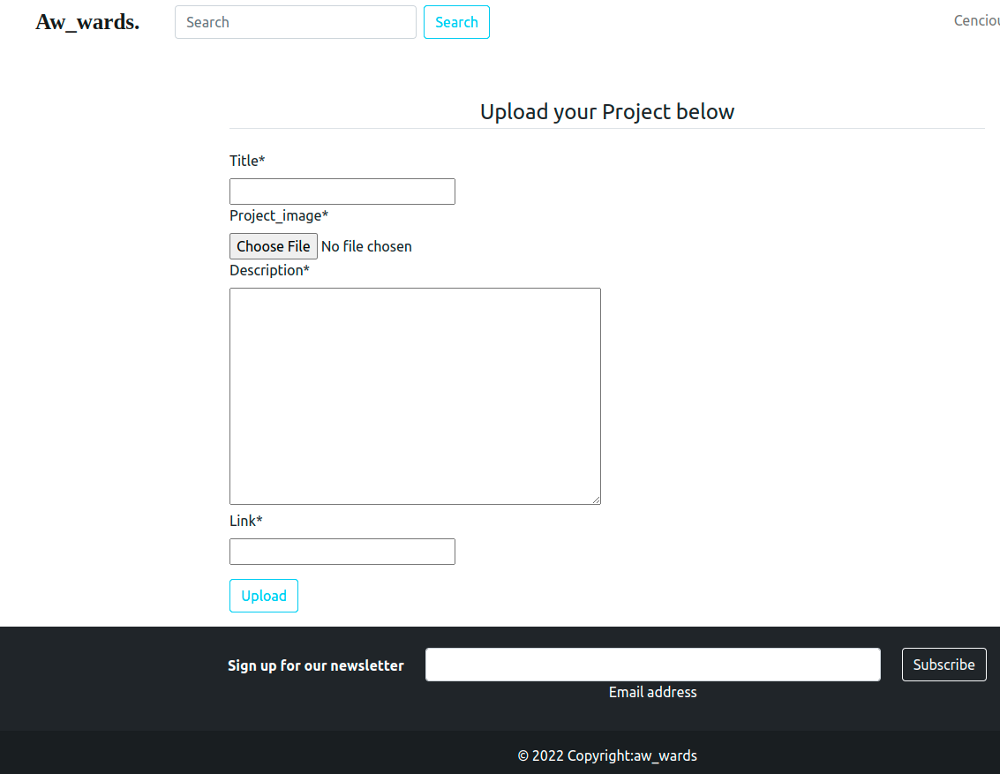

## App Name
* Aw_wards

## Author
* Innoncencia Kakan.

## Description:
The Gallery is personal gallery application that display photos for others to see.

## Live link:
https://el-awards.herokuapp.com/

##

## User stories

* A user can view posted projects and their details.

* A user can post a project to be rated/reviewed
* A user can rate/review other users' projects.
* A user can search for projects.
* A user can view projects overall score.
* A user can view their profile page.

**BDD**  
****
Click on the project link and browse though the projects as you view the functionality and content.

If you wish to cast a vote or add your own project, tap on the respective icons and get redirected to the signup/signin page.

Edit your profile by addig profile pic, name, bio and email.

Add as many projects as you would like and get ready to have them vetted by other users.

 

## Setup/Installation Requirements
* First clone the repo $ git clone

* After cloning, navigate to the project: $ cd Aw-wards

* On your terminal run the command:- for vscode, code .| for atom, atom .

* Run the application: $ python manage.py runserver

* Now navigate to your browser at: localhost://127.0.0.8000/

## Technologies Used
* Python3  
* Django4  
* Cloudinary  
* Heroku- for deployment

## Support and contact details
* Feel free to reach out via email address kancencious@gmail.com

## License
MIT License
Copyright (c) 2022 Innoncencia Kakan/Aw_wards

